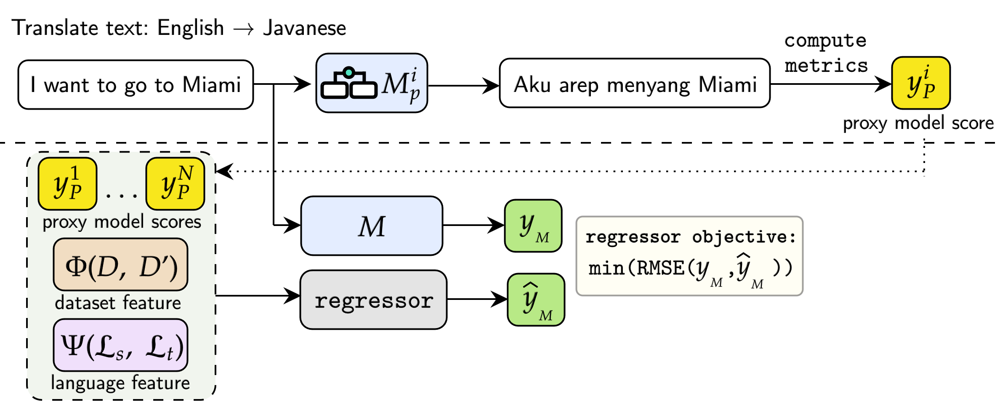

# [ProxyLM: Predicting Language Model Performance on Multilingual Tasks via Proxy Models](https://arxiv.org/abs/2406.09334)



Performance prediction is a method to estimate the performance of Language Models (LMs) on various Natural Language Processing (NLP) tasks, mitigating computational costs associated with model capacity and data for fine-tuning. Our paper introduces ProxyLM, a scalable framework for predicting LM performance using proxy models in multilingual tasks. These proxy models act as surrogates, approximating the performance of the LM of interest. By leveraging proxy models, ProxyLM significantly reduces computational overhead on task evaluations, achieving up to a 37.08x speedup compared to traditional methods, even with our smallest proxy models. Additionally, our methodology showcases adaptability to previously unseen languages in pre-trained LMs, outperforming the state-of-the-art performance by 1.89x as measured by root-mean-square error (RMSE). This framework streamlines model selection, enabling efficient deployment and iterative LM enhancements without extensive computational resources.

If you are interested for more information, check out our [full paper](https://arxiv.org/abs/2406.09334).

## Contents

+ [Environment](#environment)
+ [Setup Instruction](#setup-instruction)
+ [Dataset Manual Download Links](#dataset-manual-download-links)
+ [LMs Manual Download Links](#lms-manual-download-links)
+ [Example LM Finetuning Usages](#example-lm-finetuning-usages)
+ [Example Regressor Usages](#example-regressor-usages)
+ [Citation](#citation)

## Environment

Python 3.8 or higher. Details of dependencies are in `requirements.txt`.

## Setup Instruction

1. Run `setup.sh`. The script will automatically install required dependencies, download selected models, and our curated dataset.
2. If the model or dataset cannot be downloaded successfully, please refer to section [Dataset Manual Download Links](#dataset-manual-download-links) and [LMs Manual Download Links](#lms-manual-download-links).

## Dataset Manual Download Links

1. Download our curated [dataset](https://drive.google.com/file/d/1ixv_kXQjdQypUfvbumkc37rB2TcTWuhD/view) for LM fine-tuning. You can also download the dataset from the original papers of [MT560 dataset](https://aclanthology.org/2021.acl-demo.37) and [NusaTranslation dataset](https://aclanthology.org/2023.ijcnlp-main.60/), but we have compiled our dataset in a way that it smoothly runs within our pipeline.
2. Unzip the dataset by running `tar -xzvf dataset.tar.gz dataset` and put the `dataset` folder in `experiments` folder

## LMs Manual Download Links

If any of the download link has expired or become invalid, please use the following link below to download the model manually.

+ [SMaLL100](https://github.com/alirezamshi/small100)
+ [M2M100 (1.2B)](https://github.com/facebookresearch/fairseq/tree/main/examples/m2m_100)
+ [NLLB-200 Distilled (1.3B)](https://github.com/facebookresearch/fairseq/tree/nllb)

## Example LM Finetuning Usages

+ Start training/finetuning tasks by running:
    ```bash
    python -m src.lm_finetune.<lm_name>.main --src_lang ${src_lang} --tgt_lang ${tgt_lang} --finetune 1 --dataset ${dataset} --size ${size}
    ```

+ Start generation tasks by running:
    ```bash
    python -m src.lm_finetune.<lm_name>.main --src_lang ${src_lang} --tgt_lang ${tgt_lang} --finetune 0
    ```

+ Replace `<lm_name>` with LMs name such as `m2m100`, `nllb`, `small100`, or `transformer`.
+ All the results will be displayed in `experiments` folder

## Example Regressor Usages

+ Running a Random Experiment
  ```bash
  python -m src.proxy_regressor.main -em random -r ${regressor_name} -rj path/to/regressor_config.json -d ${dataset_name} -m ${lm_name}
  ```
+ Running a LOLO Experiment for All Languages
  ```bash
  python -m src.proxy_regressor.main -em lolo -r ${regressor_name} -rj path/to/regressor_config.json -d ${dataset_name} -m ${lm_name} -l all
  ```
+ Running a LOLO Experiment for a Specific Language
  ```bash
  python -m src.proxy_regressor.main -em lolo -r ${regressor_name} -rj path/to/regressor_config.json -d ${dataset_name} -m ${lm_name} -l ind
  ```
+ Running a Seen-Unseen Experiment
  ```bash
  python -m src.proxy_regressor.main -em seen_unseen -r ${regressor_name} -rj path/to/regressor_config.json -d ${dataset_name} -m ${lm_name}
  ```
+ Running a Cross-Dataset Experiment
  ```bash
  python -m src.proxy_regressor.main -em cross_dataset -r ${regressor_name} -rj path/to/regressor_config.json -m ${lm_name}
  ```
+ Running an Incremental Experiment
  ```bash
  python -m src.proxy_regressor.main -em incremental -r ${regressor_name} -rj path/to/regressor_config.json -d ${dataset_name} -m ${lm_name}
  ```

+ Replace `${regressor_name}` with `xgb`, `lgbm`, `poly`, or `mf`.
+ Replace `${lm_name}` with estimated LMs name such as `m2m100` or `nllb`.
+ Replace `${dataset_name}` with `mt560` or `nusa`.
+ Note that running each code will run all feature combinations.

## Citation

<u>If you use this code for your research, please cite the following work:</u>

```bibtex
@article{anugraha2024proxylm,
  title={ProxyLM: Predicting Language Model Performance on Multilingual Tasks via Proxy Models},
  author={Anugraha, David and Winata, Genta Indra and Li, Chenyue and Irawan, Patrick Amadeus and Lee, En-Shiun Annie},
  journal={arXiv preprint arXiv:2406.09334},
  year={2024}
}
```

If you have any questions, you can open a [GitHub Issue](https://github.com/davidanugraha/proxylm/issues) or send us an [email](mailto:david.anugraha@gmail.com).